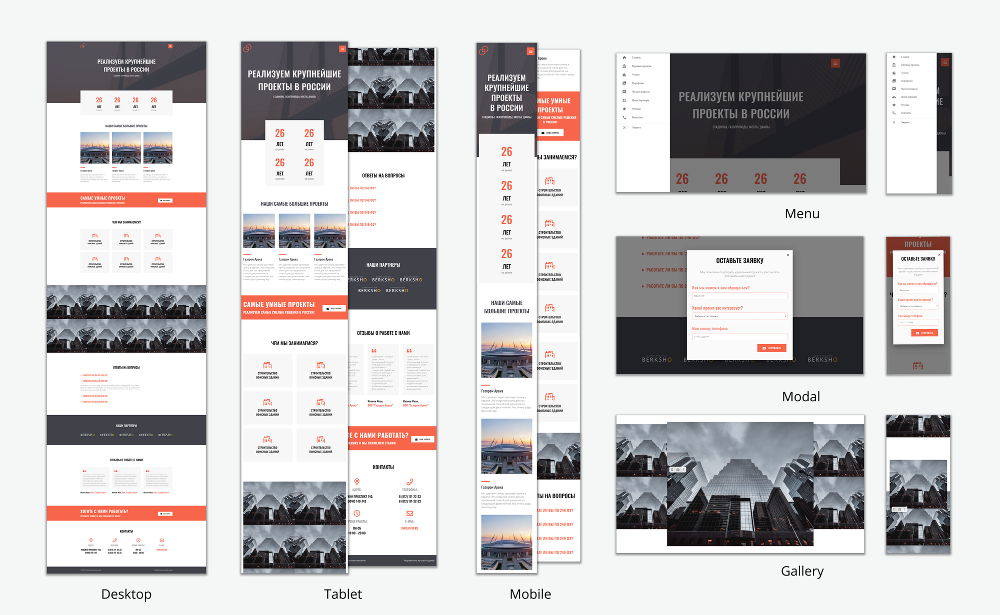

# Happy Build

Лендинг для строительной компании

## Стек технологий:
- HTML5
- CSS3
- Адаптивная и отзывчивая верстка
- Анимация на CSS
- Фреймфорк Materialize CSS (меню-бургер, модальное окно, галерея)

Сайт доступен на хостинге [GitHub Pages](https://yuliyaatrashkevich.github.io/Happy_Build/).